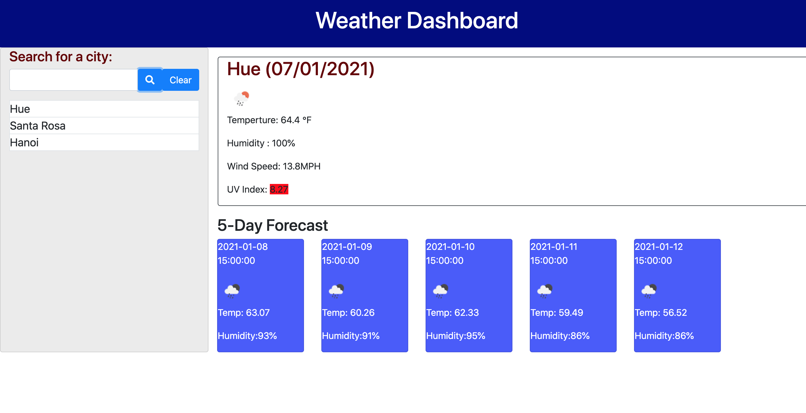

# weather-dashboard
Using data from OpenWeather API to build a weather dashboard that allows user to search for a city to check its current and future weather conditions. The weather board presents the current date, city name, temperature, humidity, wind speed, and UV index, which colors are coded with its condition. There are also 5-day forecast that includes future dates, weather conditions' icons, tempertures, and humidity. Users can also see search history in the history table on the left side of the page. Let's find some sunny city and fly there! 

## Site Picture


# Table of Contents 
[Tittle](#weather-dashboard)

[Site Picutre](#Site-picture)

[Table of Contents](#Table-of-Content)

[Description of Page Building ](#Description-of-Page-Building)

[Code Snippet](#Code-Snippet)

[Technologies Used](#Technologies-Used)

[Deployed Link](#Deployed-Link)

[Author](#Author)

[License](#License)


## Description of Page Building 
* Create a html file, a css file, and a javascript file
  
* In HTML file 
  <ul>
  <li> Build HTML in semantic structure
  <li> Link files and API websites 
  <li> Create a Nav Bar to display the title 
  <li> Organize contents of search history, current weather, and five days forecast
  </li>
  </ul>
    
* In Javascript file 
  <ul>
  <li> Name variables as pointers to html page and to use in functions
  <li> Add on click functions to generate events 
  <li> Use ajax funtion to get API querylinks from OpenWeather website 
  <li> Console log out response to traverse through the objects and find information about the weather
  </li>
  </ul>
* In Style.Css file 
  <ul>
  <li>Style cards 
  <li>Add style to search button with search icon and color  
  <li>Color headers and titles
  <li>Adjust texts, margin, and padding 
  </li>
  </ul>
## Code Snippet

Have all the events and functions in ready function to execute the code when the DOM is ready 
```javascript
$(document).ready(function () {
```
Name contents using variables 
```javascript
var UV = $("#UV-index");
var date = moment().format("DD/MM/YYYY");
var APIKey = "9fbba8bfea87cd371d313708e1beec24";
var searchHistory = JSON.parse(localStorage.getItem("city")) || [];

```
Use addEventListener function to attaches on click event to button element
```javascript 
$(".search-button").on("click", function (event) {}
  
$(".clear-button").on("click", function (){
	$(".search-history").empty();
})
```
Use conditional statement to compare the time and add class accordingly 
```javascript 
if (result < 3) {
    UV.css('background-color', 'green');
  } else if (result < 6) {
    UV.css('background-color', 'yellow');
  } else if (result < 8) {
    UV.css('background-color', 'orange');
  } else if (result < 11) {
    UV.css('background-color', 'red');
  } else {
    UV.css('background-color', 'purple');
  }
  });
  
```

Utilize backtick to create HTML tags inside js file
  ```javascript 
    var card = `
    <div class=col-md-2>
      <div class="card forecast" id="day1">
      <p class="date">${response.list[i].dt_txt}</p>
      <div></img></div>
      <p class="temp">Temp: ${response.list[i].main.temp}</p>
      <p class="humidity"> Humidity:${response.list[i].main.humidity}%</p>
      </div>
    </div>
    `
  ```
Save user input in local storage 
```javascript 
  localStorage.setItem("city", JSON.stringify(searchHistory));
  var historyarr = JSON.parse(localStorage.getItem('city'));
```

## Technologies Used
- HTML - used to create elements on the DOM
  * [HTML](https://developer.mozilla.org/en-US/docs/Web/HTML)
- CSS - styles html elements on page
  * [CSS](https://developer.mozilla.org/en-US/docs/Web/CSS)
- Javascript - gives interacticve elements to web pages
  * [Javascript](https://developer.mozilla.org/en-US/docs/Web/JavaScript)
- Bootstrap - design and customize responsive site
  * [Bootstrap](https://getbootstrap.com/)
- Jquery - use API to makes DOM traversal, manipulation, event handling, etc. simpler
  * [Jquery](https://jquery.com/)
- Git - version control system to track changes to source code
  * [Git](https://git-scm.com/)
- GitHub - hosts repository that can be deployed to GitHub Pages
  * [Github](https://github.com/)


## Deployed Link

* [See Live Site](https://vubao2303.github.io/weather-dashboard/)


## Author

* **B Tram Vu** 

- [Link to Portfolio Site](https://github.com/vubao2303)
- [Link to Github](https://github.com/vubao2303)
- [Link to LinkedIn](https://www.linkedin.com/in/tram-vu-866250121/)

## License
© 2012 — 2020 OpenWeather ® All rights reserved.

© 2020 Trilogy Education Services, a 2U, Inc. brand. All Rights Reserved.


